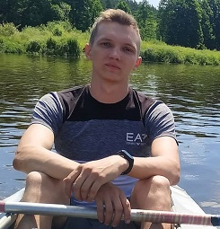

# Maksim Lapko


---

## Contacts
* Location: Minsk and Ostrovec, Belarus
* phone: +375339002508
* email: maxlmysim@gmail.com
* Instagram: [maxlmysim](https://www.instagram.com/maxlmysim/)
* Telegram: [maxlmysim](https://t.me/maxlmysim)
* Github: [maxlmysim](https://github.com/maxlmysim)
* Discord: *maxlmysim#6640*

---

## About me
I graduated from the Belarusian National Technical University with a degree in NPP steam turbine. I work to NPP at the moment. I am a professional specialist in diagnostics and electronics of cars. I want to learn JavaScript so that after studying I can become a good programmer.

---

## Skills
* HTML&CSS
* JavaScript (Basic)
* C++ (Basic)
* VSCode, WebStorm
* Git, GitHub

---

## Code Example
```
function solution(number) {

    let hundreds = ['C', 'CC', 'CCC', 'CD', 'D', 'DC', 'DCC', 'DCCC', 'CM'];
    let tens = ['X', 'XX', 'XXX', 'XL', 'L', 'LX', 'LXX', 'LXXX', 'XC'];
    let units = ['I', 'II', 'III', 'IV', 'V', 'VI', 'VII', 'VIII', 'IX'];
    let result = '';

    let digits = number.toString().split('').map(Number).reverse().forEach((digit, index) => {
        if (digit !== 0) {
            if (index === 0) result = units[digit - 1] + result;
            if (index === 1) result = tens[digit - 1] + result;
            if (index === 2) result = hundreds[digit - 1] + result;
            if (index === 3) result = 'M'.repeat(digit) + result;
        }
    });
    return result;
};
```

---

## Experience
| Work            |            Position            |  Experience |
|-----------------|:------------------------------:|------------:|
| YouTube         |            Blogger             | 2013 - 2017 |
| BNTU            |            Student             | 2014 - 2018 |
| My business  | Electronics & diagnostics cars | 2018 - 2021 |
| Nuclear Power Plant |            Engineer            |  2018 - now |

---

## Courses
* HTML&CSS [Stepik](https://stepik.org/)
* JavaScript for beginner [Stepik](https://stepik.org/)
* JavaScript Manual on [learnjavascript.ru](https://learn.javascript.ru/) (in progress)
* RS Schools Course «JavaScript/Front-end. Stage 0» (in progress)

---

## Languages
* English - PreIntermediate
* Russian - Native